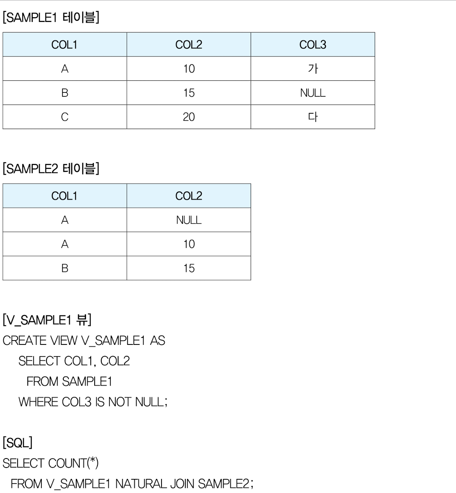

# Part2) SQL 활용

## 1. 서브쿼리(Subquery)

서브쿼리는 **위치**에 따라 다르게 부른다.

| select  | 스칼라 서브쿼리 |
| --- | --- |
| from | 인라인 뷰 |
| where, having | 중첩 서브쿼리 |

### 1) 스칼라 서브쿼리

Select, order by, insert문의 value 절 등에 사용하며, “`컬럼`”이 올 수 있는 위치에 사용함.

`반드시 하나의 값`만 을 반환해야 하며, 그렇지 않은 경우 에러.

### 2) 인라인 뷰

From 절 등 `테이블명`이 올 수 있는 위치에 사용

### 3) 중첩 서브쿼리

Where 절과 having 절에 사용할 수 있다.

1. 메인쿼리와의 관계에 따라 나누면


    | 연관 쿼리 | 서브쿼리 내 메인 쿼리 컬럼이 존재 O |
    | --- | --- |
    | 비연관 서브쿼리 | 서브쿼리 내에 메인쿼리의 컬럼이 존재 X |
2. 데이터 형테에 따라


    | 단일 행 서브쿼리 | - 서브쿼리가 1건 이하의 데이터 반환
    - 단일 행 비교 연산자와 함께 사용(=, <, > 등) | select * from product
    where price `= (SELECT MAX(price) FROM product)` |
    | --- | --- | --- |
    | 다중 행 서브쿼리 | - 서브쿼리가 여러 건의 데이터를 반환
    - 다중 행 비교 연산자와 함께 사용 | select * from product
    where price `IN (SELECT product_code FROM product_review)` |
    | 다중 컬럼 서브쿼리 | 서브쿼리가 여러 컬럼의 데이터를 반환 | select * from employees
    where (job_id, salary) `IN (SELECT job_id, max_salary FROM jobs WHERE max_salary = 10000);` |

<aside>
⚠️

p179 문제) 단일 행 조건이 아니면 `=` 조건과 같이 쓸 수 없다. 에러가 발생한다.

</aside>

## 2. 뷰(View)

**하나 이상의 테이블을 기반으로 하는 `가상의 테이블`**입니다.

```sql
create view v_sample1 as
select col1, col2
from sample1
where col3 is not null;
```

- p182 문제

    

    V_SAMPLE1과 SAMPLE2에서 **공통 컬럼은 COL1, COL2이다**. `NATURAL JOIN`은 이 두 컬럼을 기준으로 **`양쪽 테이블에 모두 같은 값`**이 있을 때만 조인됨.

    조인 가능한 조합은 1건(A, 10) 만이다.


## 3. 집합 연산자

각 쿼리의 결과 집합을 가지고 연산하는 명령어.

| UNION ALL | 합집합. 중복행 모두 출력 |  |
| --- | --- | --- |
| UNION | 합집합. (중복 시 1행) | 중복 행 제거 과정으로 성능 UNION ALL 보다 낮음. |
| INTERSECT | 교집합. (중복 시 1행) | 헤더는 첫 번째 쿼리를 따라감. |
| MINUS/EXCEPT | 차집합. (중복 시 1행) |  |

## 4. 그룹 함수

| 집계함수 | count, sum, avg, max, min 등 |
| --- | --- |
| 소계(총계) 함수 | rollup, cube, grouping, sets 등 |

### 1) ROLLUP

소그룹간의 **소계 및 총계**를 계산.

```sql
ROLLUP(A) -- A로 그룹핑 / 총합계
ROLLUP(A, B) -- A,B로 그룹핑 / A로 그룹핑 / 총합계
ROLLUP(A, B, C) -- A,B,C로 그룹핑 / A,B로 그룹핑 / A로 그룹핑 / 총합계
```

**✅ 기본 문법**

```sql

SELECT 컬럼1, 컬럼2, 집계함수
FROM 테이블
GROUP BY ROLLUP(컬럼1, 컬럼2);
```

**✅ 예제 테이블: sales**

| **region** | **product** | **amount** |
| --- | --- | --- |
| A | X | 100 |
| A | Y | 200 |
| B | X | 150 |
| B | Y | 300 |

**✅ 예제 1: ROLLUP(region, product) 사용**

```sql
SELECT region, product, SUM(amount)
FROM sales
GROUP BY ROLLUP(region, product);
```

| **region** | **product** | **sum(amount)** |
| --- | --- | --- |
| A | X | 100 |
| A | Y | 200 |
| A | NULL | 300  ← A의 소계 |
| B | X | 150 |
| B | Y | 300 |
| B | NULL | 450  ← B의 소계 |
| NULL | NULL | 750  ← 전체 총계 |

> NULL은 **그 그룹에 대한 소계/총계 행**을 의미
>

### 2) CUBE

소그룹 간의 **소계 및 총계를 다차원적**으로 계산. (**모든 가능한 조합의 소계를 계산함**)

```sql
CUBE(A) -- A로 그룹핑 / 총합계
CUBE(A, B) -- A,B로 그룹핑 / A로 그룹핑 / B로 그룹핑 / 총합계
CUBE(A, B, C) -- A,B,C로 그룹핑 / A,B로 그룹핑 / A,C로 그룹핑 / B,C로 그룹핑 / A로 그룹핑 / B로 그룹핑 / C로 그룹핑 / 총합계
```

**✅ CUBE(region, product) 예시**

```sql
SELECT region, product, SUM(amount)
FROM sales
GROUP BY CUBE(region, product);
```

**📌 결과:**

| **egion** | **product** | **sum(amount)** |
| --- | --- | --- |
| A | X | 100 |
| A | Y | 200 |
| A | NULL | 300  ← A의 소계 (모든 제품) |
| B | X | 150 |
| B | Y | 300 |
| B | NULL | 450  ← B의 소계 |
| NULL | X | 250  ← X 제품 소계 (모든 지역) |
| NULL | Y | 500  ← Y 제품 소계 |
| NULL | NULL | 750  ← 전체 총계 |

### 3) GROUPING SETS

특정 항목 **소계**. 괄호`()` 추가시 **총합계**

```sql
GROUPING SETS(A, B) -- A그룹핑 / B그룹핑
GROUPING SETS(A, B,()) -- A그룹핑 / B그룹핑 / 총합계
GROUPING SETS(A, ROLLUP(B)) -- A그룹핑 / B그룹핑 / 총합계
GROUPING SETS(A, ROLLUP(B, C)) -- A그룹핑 / B,C그룹핑 / B그룹핑 / 총합계
```

<aside>
⚠️

ROLLUP 은 인수 순서에 따라 결과가 다름.
CUBE, GROUPING SETS은 순서에 영향 안받음.

</aside>

### 4) GROUPING

소계를 나타내는 row에 원하는 텍스트 넣을 수 있음.

```sql
SELECT CASE GRUPING(ORRDER_DT)
					WHEN 1 THEN 'TOTAL' ELSE ORDER_DT
				END AS ORDER_DT,
				COUNT(*)
	FROM STARBUCKS_ORDER
GROUP BY ROLLUP(ORDER_DT)
ORDER BY ORDER_DT;
```

Oracle의 경우 **DECODE** 문으로 CASE 문을 대체할 수있음.

```sql
-- DECODE(비교할_값, 조건1, 결과1, ..., 기본값)
SELECT DECODE(GROUPING(ORDER_DT), 1, 'TOTAL', ORDER_DT) AS ORDER_DT, COUNT(*)
	FROM STARBUCKS_ORDER
GROUP BY ROLLUP(ORDER_DT)
ORDER BY ORDER_DT;
```


## 5. 윈도우 함수

OVER 키워드와 함께 사용되는 함수들. (행 변화 없음)

| 순위 함수 | rank, dense_rank, row_number |
| --- | --- |
| 집계 함수 | sum, max, min, avg, count |
| 행 순서 함수 | first_value, last_value, lag, lead |
| 비율 함수 | cume_dist, percent_rank, ntitle, ratio_to_report |

**✅ 윈도우 함수 범위 지정 표 (ROWS /  RANGE)**

| **구문 (범위)** | **의미** | **예시 행 기준 포함 범위** |
| --- | --- | --- |
| UNBOUNDED PRECEDING | 가장 처음부터 | **시작~현재 행**까지 누적 |
| CURRENT ROW | 현재 행 | 현재 행만 |
| UNBOUNDED FOLLOWING | 마지막까지 | 현재 행~끝까지 |
| N PRECEDING | 현재 행 기준 앞쪽 N개 포함 | 현재 행 포함, 앞쪽 N행 |
| N FOLLOWING | 현재 행 기준 뒤쪽 N개 포함 | 현재 행 포함, 뒤쪽 N행 |

**✅ 조합 예시 (ROWS BETWEEN ... AND ...)**

| **구문** | **의미** | **설명** |
| --- | --- | --- |
| ROWS BETWEEN UNBOUNDED PRECEDING AND CURRENT ROW | 누적 | 시작부터 현재 행까지 (기본값) |
| ROWS BETWEEN CURRENT ROW AND UNBOUNDED FOLLOWING | 이후 누적 | 현재 행부터 마지막까지 |
| ROWS BETWEEN 1 PRECEDING AND 1 FOLLOWING | 전후 포함 | 현재 행 기준, 앞뒤 한 행 포함 |
| ROWS BETWEEN 2 PRECEDING AND CURRENT ROW | 2개 앞까지 포함 | 현재 행 포함, 앞의 2개 포함 |
| ROWS BETWEEN CURRENT ROW AND 2 FOLLOWING | 이후 2개까지 | 현재 행 포함, 뒤의 2개 포함 |

### 1) 순위 함수

- **`RANK`**: 중복 시 순자 건너뜀 (1 , 2, 2, 4…)
- **`DENSE_RANK`**: 중복 상관 없이 순서대로(1, 2, 2, 3…)  `dense: 밀집한`
- **`ROW_NUMBER`**: 동일한 값이라도 순서대로 순위 매김(1,2,3,4...)

**✅ 예시**

```sql
SELECT region, product, amount,
     RANK() OVER (PARTITION BY region ORDER BY amount DESC) AS RANK
FROM sales;
```

### 2) 집계함수

- **`SUM`**: 합계(숫자)

    <aside>
    ⚠️

    p233문제) SUM 할 때 OVER절에서 ORDER BY를 명시하면 RANGE UNBOUNDED PRECEDING 구문이 없어도 누적합이 집계됨.

    </aside>

- **`MAX`**: 최대값
- **`MIN`**: 최소값
- **`AVG`**: 평균
- **`COUNT`**: 건수
- **💁‍♀️ 윈도우 함수 사용 옵션**

    

    


### 3) 행 순서 함수 (**MSSQL 미지원**) (p.251문제 다시보기)

- **`FIRST_VALUE`**: 파티션별 가장 첫번째 데이터
- **`LAST_VALUE`**: 파티션별 가장 끝값 데이터
- **`LAG`**: 파티션별로 특정 수만큼 앞선 데이터 구함

    ```sql
    LAG(SCORE, 2) OVER(ORDER BY SCORE) AS LAG -- 두번째 앞에 있는 성적 데이터를 가져옴. (두번째 인수를 안적은 경우, default는 1)
    ```

- LEAD: 파티션별 특정 수만큼 뒤에 있는 데이터를 구하는 함수.

### 4) 비율 함수 (**MSSQL** 미지원)

- **`RATIO_TO_REPORT`**: 합계에서 차지하는 비율(합계 1)

    ```sql
    select name, job_id, salry,
    	RATIO_TO_REPORT(salary) OVER(PARTITION BY job_id) AS result
    FROM employees;
    ```

- **`PERCENT_RANK`**: 현재 행이 위치하는 백분위 순위 값(0~1)
- **`CUME_DIST`**: 누적 백분율(0~1)
- **`NTILE`**: 행들을 n등분한 후 현재 행에 해당하는 등급을 구함.

    

    NTITLE(3)을 보면 **`동등하게 못 나눌 경우 맨 앞 그룹부터 더 채워짐**.`


## 6. Top-N 쿼리

### 1) ROWNUM

oracle에서는 수도 컬럼(가짜 컬럼)이다. 행 앞에 No. 번호를 붙이는 것.

**✅ ROWNUM <, <= 사용시 주의할 점**

<aside>
⚠️

WHERE 문에 order by 보다 먼저 수행되기 때문에 정렬된 값에서 rownum < 5를 가져오려는 경우, order by로 정렬하는 것이 아닌 from 절에서 정렬된 서브쿼리 테이블을 추가해서 가져와야 함.

</aside>

### 2) 윈도우 함수의 순위 함수

ROW_NUMBER, RANK, DESENC_RANK로도 순위를 매길 수 있다.

```sql
SELECT * FROM (
  SELECT ROW_NUMBER() OVER(ORDER BY 국어 DESC, 영어 DESC, 수학 DESC) AS RNUM,
    이름, 국어, 영어, 수학,
    FROM 시험성적
)
WHERE RNUM <= 5;
```

## 7. 셀프 조인(Self Join)

동일한 테이블을 두 번 이상 조인함. 쇼핑몰에서 카테고리 대-중-소를 나타낼 때 쓰는 구조

FROM 절에 같은 테이블을 2번 쓰기 때문에 반드시 alias를 써서 테이블 구분을 해야 함.


## 8. 계층 쿼리⭐️(어렵다..)

계층 구조를 이루는 컬럼이 존재할 경우, 계층 쿼리를 이용해서 데이터를 출력할 수 있다.

```sql
SELECT LEVEL,
	SYS_CONNECT_BY_PATH('['||CATEGORY_TYPE||']'|| CATEGORY_NAME, '-') AS PATH
	FROM CATEGORY
START WITH PARENT_CATEGORY IS NULL
CONNECT BY PRIOR CATEGORY_NAME = PARENT_CATEGORY;
```

- **`LEVEL`**: 현재 노드의 계층 깊이를 나타냄 (대분류: 1, 중분류: 2, …).
- **`SYS_CONNECT_BY_PATH(...)`**: 루트부터 현재 노드까지의 경로를 문자열로 이어줌.
- **`START WITH PARENT_CATEGORY IS NULL`**: 여기서는 부모가 없는 노드(PARENT_CATEGORY가 NULL), 즉 **대분류**부터 시작
- **`CONNECT BY PRIOR CATEGORY_NAME = PARENT_CATEGORY`**: 계층 연결 조건. **부모 CATEGORY_NAME = 자식의 PARENT_CATEGORY**인 경우를 계속 따라감.
- **`CONNECT_BY_ROOT`** 컬럼: 루트 노드의 주어진 컬럼 값을 반환.
- **`CONNECT_BY_ISLEAF`**: 가장 하위 노드인 경우 1, 아니면 0

**계층 구조 + 정렬**을 하려면 `ORDER BY` 대신 **`ORDER SIBLINGS BY`** 를 써야한다.

## 9. PIVOT 절과 UNPIVOT 절

### 1) PIVOT 절

 **원본 데이터**를 **`행→열`**로 변환시켜 테이블 출력함.

**✅ 기본 구성 요소**

```sql
**집계 함수 FOR 피벗할 컬럼 IN (피벗할 컬럼명 지정)**
```

✅ **예시**

- 인라인 뷰, 집계함수, 데이터를 나열한 IN 절

```sql
SELECT *
FROM (SELECT grade, dept_name, salary FROM employees)
PIVOT (
  SUM(salary)
  FOR dept_name IN ('인사팀', 'it개발팀', 'ai연구팀', '클라우드팀')
)
ORDER BY grade;
```

<aside>
⚠️

p289 문제) PIVOT에서 헤더명은 IN 절에 붙은 alias와 집계함수의 별칭을 언더바(_)와 함께 표시한다. 집계할 데이터가 없는 경우, NULL 로 표시됨.

</aside>

### 2) UNPIVOT 절

피벗의 반대로 집계된 데이터를 **`열→행`**으로 변환시킴.

**✅ 기본 구성 요소**

```sql
**언피벗될 컬럼 FOR 언피벗된 값에 대한 설명이 들어갈 컬럼 IN (FOR에 들어갈 데이터 값)**
```

✅ **예시**

- 결과 데이터에 출력될 헤더명 네이밍, IN 절에는 기존 컬럼명 나열

```sql
SELECT GRADE, DEPT_NAME, SALARY FROM EMP_INFO_PIVOT
UNPIVOT (SALARY FRO DEPT_NAME IN (HR, IT, AI, CLOUT)
ORDER BY GRADE;
```

> UNPIVOT 시 NULL 출력을 원하면, `INCLUDE NULLS` 옵션을 사용
>

```sql
UNPIVOT INCLUDE NULLS (SALARY FRO DEPT_NAME IN (HR, IT, AI, CLOUT)
```

## 10. 정규표현식

특정 규칙에 맞는 문자열 패턴 정의

### 1) REGEXP_SUBSTR 함수

문자열에서 특정 패턴을 있으면 추출하는 함수

```sql
SELECT REGEXP_SUBSTR('SQL', 'S.L') AS RESULT1
SELECT REGEXP_SUBSTR('SQLD', 'S.L') AS RESULT2
SELECT REGEXP_SUBSTR('SQLD', 'S..L') AS RESULT3
```

| RESULT1 | RESULT2 | RESULT2 |
| --- | --- | --- |
| SQL | SQL | [NULL] |

**✅ 정규 표현식의 기본 연산자**


**✅ 매개변수**

```sql
REGEXP_SUBSTR('1234567890','(123)(4(56)(78))', 1, 1 'i', 1)
```

- 1: 검색 시작 위치
- 1: 첫 번째로 일치하는 패턴
- ‘i’: 대소문자 구분 없이 검색
- 1: 첫 번째 그룹과 일치
← 결과 데이터에서 확인되는 순서(1: ‘123’, 2: ‘45678’, 3: ‘56’, 4: ‘78’)

**예시)**

`^[A-Z]+` : 대문자로 시작하고 1개 이상의 연속된 문자 추출.

`010[-]?[0-9]{3,4}[-]?[0-9]{4}`: 전화번호 추출.

### 2) REGEXP_REPLACE 함수

일치하는 부분을 찾아 다른 문자열로 대체. **일치한 부분 모두 대체함**

✅ **예시**

```sql
SELECT REGEXP_SUBSTR('010-1234-5678', '[0-9]', '*') AS RESULT FROM DUAL;
```

| RESULT |
| --- |
| ***-****-**** |

### 3) REGEXP_INSTR 함수

**일치하는 부분의 위치를 반환**


**✅ 인수 순서**

1. 검색할 문자열
2. 정규 표현식, 찾을 값
3. 찾는 위치(시작: 1)
4. 찾는 횟수(2면 두번째로 찾은 위치)
5. 일치한 문자열의 시작/끝 위치 반환(0: 시작, 1: 끝)
6. 대소문자 구분(기본 ‘c’는 구분, ‘i’는 구분하지 않음)

### 4) REGEXP_COUNT 함수

일치하는 부분의 횟수를 나타냄.


**✅ 인수 순서**

1. 검색할 문자열
2. 정규 표현식, 찾을 값
3. 찾는 위치(시작: 1)
4. 대소문자 구분(기본 ‘c’는 구분, ‘i’는 구분하지 않음)

### 4) REGEXP_LIKE 함수

복잡한 특정 패턴과 일치하는 문자열을 찾을 때 사용.

```sql
SELECT NAME
FROM HR
WHERE REGEXP_LIKE (NAME, '^Ste(v|ph)en$');

-- Stephen, Steven 등등
```

## 문제

6.
윈도우 함수에서 ORDER BY 를 쓸 때 범위 조건이 없으면 default로 RANGE UNBOUNDED PRECEDING이 됨. 누적 최소값으로 동작한다.

```sql
MIN(SALARY)
OVER (
  PARTITION BY DEPARTMENT_ID
  ORDER BY HIRE_DATE
  ROWS BETWEEN UNBOUNDED PRECEDING AND CURRENT ROW --기본으로 이렇게 동작
)
```

15.
현재 컬럼의 위, 아래 1개를 합한 숫자이다.

| **구문 (범위)** | **의미** | **예시 행 기준 포함 범위** |
| --- | --- | --- |
| UNBOUNDED PRECEDING | 가장 처음부터 | **시작~현재 행**까지 누적 |
| CURRENT ROW | 현재 행 | 현재 행만 |
| UNBOUNDED FOLLOWING | 마지막까지 | 현재 행~끝까지 |
| **N PRECEDING** | 현재 행 기준 앞쪽 N개 포함 | 현재 행 포함, 앞쪽 N행 |
| **N FOLLOWING** | 현재 행 기준 뒤쪽 N개 포함 | 현재 행 포함, 뒤쪽 N행 |

23.
`START WITH PARENT_ID = 4`
→ PARENT_ID = 4인 행부터 시작 (즉, 딸)
`CONNECT BY FAMILY_ID = **PRIOR** PARENT_ID;` 라고 하면
내 FAMILY_ID가 상위 행의 PARENT_ID랑 같다
**딸부터 시작해서, 자식→부모 방향으로 연결**된다.

26.
select절에서 alias를 사용하면 where절에서는 못 쓰는게 기본 원칙!
but, 서브쿼리에서 alias를 사용하면 FROM절에 들어가므로 where절에서 alias사용 가능

**32.
Oracle에서 UNPIVOT은 NULL 을 제외해서 동작함. MSSQL은 NULL포함한다고 함.**

34.
REGEXP_INSTR은 위치인 숫자를 출력한다.

35.
REGEXP_LIKE에서 ^[A-Za-z]+[0-9]+$ 는 문자열이 알파벳으로 시작해서 숫자로 끝나야하는데, !로 끝났기 때문에 false라서 아무 데이터도 출력되지 않는다.
