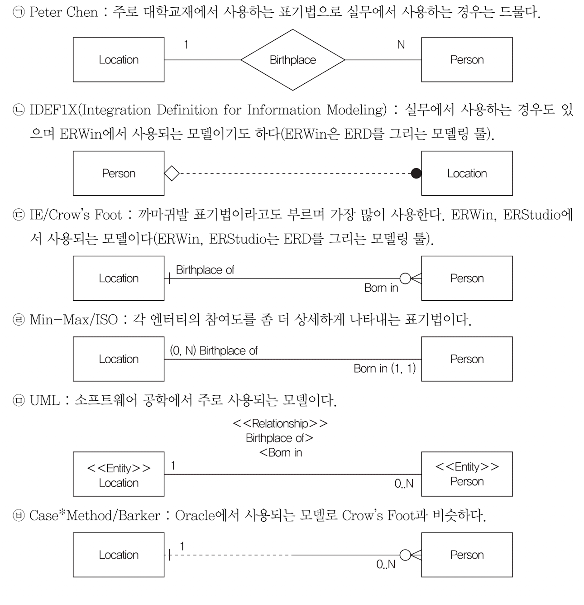

# Part 1) 데이터 모델링의 이해

## 1. 데이터 모델의 이해

### 1) 모델링이란?

데이터베이스 모딜링은 ‘현실 세계를 단순화하여 표현하는 기법’

### 2) 모델링의 특징

- **추상화**: 현실 셰계를 일정한 형식으로 표현
- **단순화**: 복잡한 것을 단순하고 쉽게 표현
- **명확화**: 불분명함을 제거하고 명확하게 해석

### 3) 모델링의 3가지 관점

- **데이터 관점(what)**:
  데이터 간의 관게에 대한 모델링
- **프로세스 관점(how):**
  실제 처리하고 있는 일에 대한 모델링
- **데이터와 프로세스의 상관 관점(data vs process, interaction):**
  프로세스 흐름에 따라 데이터가 어떤 영향을 받는지 모델링

> 데이터 품질을 보장하기 위한 데이터 모델링 시 유의 사항

- **중복**: 같은 데이터가 여러 엔터티에 중복으로 저장되는 것 지양.
- **비유연성**:데이터 모델과 프로세스를 분리하여 유연성을 높이는 것이 바람직
- **비일관성**: 데이터 간의 연관 관계를 명확하게 정의해야 함.

### 4) 모델링의 세 가지 단계

1. **개념적 데이터 모델링:**
   추상화 레벨이 가장 높은 모델링. 포괄적인 수준의 모델링 진행
2. **논리적 데이터 모델링:**
   재사용성이 가장 높은 모델링. 데이터베이스 모델에 대한 key, 속성, 관계 등을 표현
3. **물리적 데이터 모델링:**
   실제 데이터베이스로 구현할 수 있도록 성능, 가용성 등의 물리적인 성격을 고려한 모델

### 5) 데이터의 독립성

1. **3단계 스키마 구조**
   1. **외부 스키마**: 사용자가 보는 데이터 모습
   2. **개념 스키마**: 데이터 전체 구조와 관계
   3. **내부 스키마**: 실제로 데이터를 저장하는 방식
2. **3단계 스키마 구조가 보장하는 독립성**

   스키마가 바뀌어도 다른 층에는 영향이 없도록 하는 것

   - **논리적 독립성**: 개념 스키마가 변경되어도 외부 스키마는 영향받지 않는다.
     **데이터 구조가 바뀌어도, 사용자가 보는건 그대로!**
   - **물리적 독립성**: 내부 스키마가 변경되어도 외부/개념 스키마는 영향받지 않는다.
     **저장 방식이 바뀌어도, 구조나 사용자 화면은 그대로**

### 6) ERD(Entity Relationship Diagram)

1. **ERD 표기 방식**

   

2. **IE/Crow’s Foot 표기법**

   

3. **ERD 작성 순서**
   1. 엔터티 도출 후 그린다.
   2. 엔터티 배치
   3. 엔터티 간의 관계 설정
   4. 관계명 기입
   5. 관계의 참여도 기입
   6. 관계의 필수/선택 여부 기입

## 2. 엔터티(Entity)

### 1) 엔터티란?

- ‘독립체’. 식별이 가능한 객체
- 업무에서 쓰이는 데이터를 용도별로 분류한 그룹.
- 정보를 저장할 수 있는 사람, 장소, 물건, 사건, 개념

> 엔터티: Table
> 인스턴스: Row
> 속성: Column

### 2) 엔터티의 특징

1. 업무에서 쓰이는 정보
2. 유니크함을 보장할 수 있는 **식별자**가 있어야 함.
3. **2개 이상의 인스턴스**를 가지고 있어야 함.
4. 반드시 **속성**을 가져야 함.
5. **다른 엔터티와 1개 이상의 관계**를 가져야 함.

### 3) 엔터티의 분류

1. 유형 vs 무형

   | 유형 엔터티 | 물리적 형태(안정적, 지속적) : 상품, 회원 등            |
   | ----------- | ------------------------------------------------------ |
   | 무형 엔터티 | 물리적 형태 없음(개념적) : 부서, 학과 등               |
   | 사건 엔터티 | 행위(빈번함, 통계 자료로 이용가능) : 주문, 이벤트 응모 |

2. 발생시점

   | 기본 엔터티 | - 업무에 원래 존재하는 정보

   - 독립적으로 생성되며, 자식 엔터티를 가질 수 있음.
     예) 상품, 회원, 사원, 부서 등 |
     | --- | --- |
     | 중심 엔터티 | - 기본 엔터티로부터 파생되고, 행위 엔터티 생성.
   - 업무에 있어서 중심적인 역할을 하며 데이터의 양이 많이 발생
     예) 주문, 매출, 계약 등 |
     | 행위 엔터티 | - 2개 이상의 엔터티로부터 파생
   - 데이터가 자주 변경되거나 증가할 수 있음
     예) 주문 내역, 이벤트 응모 이력 등 |

> 엔터티는 귀중해(기중행) 로 외우기

**엔터티 작명할 때 주의점**

- 업무에서 실제 사용하는 용어로 짓기
- 한글은 약어 지양, 영문은 대문자로
- 단수 명사 사용, 띄어쓰지 x
- 다른 엔터티와 의미상으로 중복될 수 없음
- 해당 엔터티가 갖고 있는 데이터가 무엇인지 명확하게 표현

## 3. 속성

### 1) 속성이란?

사물이나 개념의 특징을 설명해줄 수 잇는 항목

### 2) 속성값

속성값은 엔터티에 속한 하나의 인스턴스의 데이터.

### 3) 엔터티, 인스턴스, 속성, 속성값의 관계

1. 한 개의 엔터티는 두 개 이상의 인스턴스를 갖는다.
2. 한 개의 인스턴스는 두 개 이상의 속성을 갖는다.
3. 한 개의 속성은 하나의 속성값을 갖는다.
4. 하나의 엔터티는 두 개 이상의 속성을 갖는다.
5. 속성은 의미상 더 이상 쪼개지지 않는 레벨이다.

### 4) 분류

1. **특성**에 따른 분류

   | 기본 속성 | 업무 프로세스 분석을 통해 바로 정의가 가능한 속성                        |
   | --------- | ------------------------------------------------------------------------ |
   | 설계 속성 | 업무에 존재하지는 않지만 설계하다 보니 필요하다고 판단되어 도출해낸 속성 |
   | 파생 속성 | 다른 속성의 속성값을 계산하거나 특정한 규칙으로 변형하여 생성한 속성     |

2. **구성방식**에 따른 분류

   | PK 속성   | 엔터티의 인스턴스를 식별할 수 있는 속성 |
   | --------- | --------------------------------------- |
   | FK 속성   | 다른 엔터티의 속성에서 가져온 속성      |
   | 일반 속성 | PK, FK를 제외한 나머지 속성             |

### 5) 도메인

속성값의 범위.

> 추가적인 내용

- **용어사전**: 속성의 이름을 정확, 직관적으로 부여하고 용어의 혼란을 없애기 위해 용어사전이라는 업무사전을 프로젝트에서 사용한다.
- **시스템 카탈로그**: 사용자 테이블과 별개로 시스템 자체에 관련이 있는 데이터를 담고 있는 데이터 베이스. 이 내부에 저장된 데이터는 메타 데이터라고 하며, select만 가능하다.

## 4. 관계

### 1) 관계란?

엔터티와 엔터티의 관계를 의미. 연관성에 따라 **존재 관계**, **행위 관계**로 나눌 수 있음.

### 2) 존재 관계

엄마-아기 처럼 존재 자체로 연관성이 있는 관계. ex) 직원-부서, 학생-학과

### 3) 행위 관계

특정 행위에 대한 관계. ex) 회원-주문, 학생-출석부

### 4) 표기법

| **관계명**       | 관계의 이름              |
| ---------------- | ------------------------ |
| **관계차수**     | 관계에 참여하는 수       |
| **관계선택사양** | 필수인지 선택인지의 여부 |

1. 관계명

   명확한 문장으로 표현. ex) 주문한다. 소속된다. 등등

2. 관계차수

   1:1:, 1:M, M:N 형식

   

3. 관계선택사양

   | 필수적 관계 | 참여자가 반드시 존재해야 하는 관계 | 주문-주문상품 |
   | ----------- | ---------------------------------- | ------------- |
   | 선택적 관계 | 참여자가 없을 수도 있는 관계       | 학생-출석     |

## 5. 식별자

### 1) 식별자

인스턴스를 구분하게 만들어주는 대표 속성.

### 2) 주식별자

기본키, PK(Primary Key)에 해당하는 속성. 하나 또는 여러개가 주식별자가 될 수 있다.

| 유일성 | 인스턴스 유니크함을 부여해 식별 가능해야 함. |
| ------ | -------------------------------------------- |
| 최소성 | 유일성을 보장하는 최소 개수의 속성           |
| 불변성 | 속성값이 변하지 않아야 함.                   |
| 존재성 | 속성값이 NULL 이면 안됨.                     |

### 3) 분류

### 4) 식별자 관계 vs 비식별자 관계

1. **식별자 관계**

   부모 엔터티의 식별자가 자식 엔터티의 **주식별자**가 되는 관계

2. **비식별자 관계**

   부모 엔터티의 식별자가 자식 엔터티의 주식별자가 아닌 **일반 속성**이 되는 관계

## **`p.32 적중 예상 문제`**

1. x → 4번 연계성이 높으면 애플리케이션이 변경될 때마다 데이터 모델도 변경되어야 하는 상황이 올 수 있다. 즉 비유연성을 가지게 된다.
2. 3
3. x → ?
4. 4
5. 1
6. 4

   

7. 1 → 2 데이터 모델을 보면 회원과 배송지와의 관계를 표현했고, 1:M 표현이므로 한명의 회원이 반드시 하나 이상의 배송지를 갖게 된다.
8. 3
9. 3 → 4: **참여도**(1:1, 1:N, M:N) 후 **필수 여부**(필수(|), 선택(O)) 를 나타낸다.
10. 1
11. 2
12. 3 → 4 [표기법 다시 보기](https://www.notion.so/Part-1-1f798f03678080b1af05e43164898291?pvs=21)
13. 3
14. 1
15. 1
16. 2 → 엔터티 간의 필수 여부를 나타내는 것은 **`관계선택사양`**이다.
17. 2
18. 3 → [다시보기](https://www.notion.so/Part-1-1f798f03678080b1af05e43164898291?pvs=21) 보조식별자는 “아이디”처럼 대표 식별자가 아닌 식별자.
19. 1
20. 2 → 인조식별자는 속성을 하나로 묶어 사용하는 식별자.

# Chapter 2 데이터 모델과 SQL

## 1. 정규화

데이터 정합성(데이터의 정확성, 일관성을 유지하고 보장)을 위해 엔터티를 작은 단위로 분리하는 과정

### 1) 제 1정규형

모든 속성은 반드시 하나의 값만 가져야 한다.

<aside>
⚠️

p.44 문제 ) 정규화를 하면 엔터티가 계속 증가하므로 JOIN으로 인한 조회 성능 저하가 발생할 수 있다

</aside>

### 2) 제 2정규형

엔터티의 모든 일반속성은 반드시 모든 주식별자에 종속되어야 한다.

### 3) 제 3정규형

주식별자가 아닌 모든 속성 간에는 서로 종속될 수 없다.

### 4) 주의사항

지나친 정규화는 오히려 성능 저하를 일으킬 수 있다.

## 2. 반정규화

데이터의 조회 성능을 향상시키기 위해 **데이터의 중복을 허용하거나 데이터를 그룹핑**하는 과정

정규화가 끝난 후 거치게 되며, 일정한 룰이 존재한다.

### 1) 테이블 반정규화

1. **테이블 병합**

   join이 많아 테이블 통합하는 것이 성능 측면에서 유리할 경우 고려함.

2. **테이블 분할**
   - **테이블 수직 분할**: 엔티티의 일부 속성을 별도의 엔티티로 분할**(1:1관계)**
   - **테이블 수평 분할**: 엔티티의 인스턴스 특정 기준으로 별도의 엔티티로 분할**(파티셔닝)**
     - 주문(2022, 2023): **파티션** 기능을 사용하여 주문일자에 따라 데이터를 물리적으로 분리
3. **테이블 추가**
   - **중복 테이블 추가**: 데이터 중복을 감안하더라도 성능상 반드시 필요한 경우
   - **통계 테이블 추가**: 통계적 자료에 대해 엔터티를 추가
   - **이력 테이블 추가**
   - **부분 테이블 추가**
     - 특정 속성에 대해서 다량의 데이터 건이 생기는 경우, 부분적으로 테이블 생성

### 2) 컬럼 반정규화

1. **중복 컬럼** 추가

   JOIN이 많을 경우, 성능을 위해서

2. **파생 컬럼** 추가

   부하가 걸리는 계산 값 미리 컬럼에 추가

3. **이력 테이블 컬럼** 추가

   대량의 이력 테이블 조회 시, 속도가 느려질 것을 대비해

### 3) 관계 반정규화(중복 관계 추가)

JOIN 이 필요한 경우가 많아 중복 관계를 추가하는 것이 성능 측면에 유리할 경우 고려.

## 3. 트랜잭션

데이터를 조작하기 위한 하나의 논리적 작업 단위.

`원자성, 일관성, 고립성, 지속성`

| **특징** | **이름(영문)** | **쉬운 설명**                               | **예시**                                    |
| -------- | -------------- | ------------------------------------------- | ------------------------------------------- |
| 원자성   | Atomicity      | 모두 실행되거나 하나도 실행되지 않음        | 송금 시 돈을 빼고 넣는 작업이 함께 이루어짐 |
| 일관성   | Consistency    | 처리 전후 데이터 규칙(제약조건 등)이 지켜짐 | 계좌 잔액이 규칙에 어긋나지 않도록 유지됨   |
| 고립성   | Isolation      | 동시에 여러 작업을 해도 서로 영향 없음      | 동시에 주문해도 주문 내용이 섞이지 않음     |
| 지속성   | Durability     | 한 번 저장된 데이터는 영구적임              | 전원이 꺼져도 주문 정보는 보존됨            |

## 4. NULL

### 1) NULL이란?

존재하지 않음. 값 없음.

| 테이블 **`가로`** 연산 | NULL 포함 시, 결과값 NULL |
| ---------------------- | ------------------------- |
| 테이블 **`세로`** 연산 | NULL 제외하고 연산        |

## 5. 본질식별자 vs 인조식별자

식별자를 대체 여부 기준으로 분류 시

| 본질 식별자 | - 업무 프로세스에 존재하는 식별자

- 가공되지 않은 원래의 식별자
- | 원조식별자라고도 함 |
  | ------------------- | ------------------------------------------------------------------------------- |
  | 인조 식별자         | - 주식별자의 속성이 두 개 이상인 경우 그 속성들을 하나로 묶어서 사용하는 식별자 |
- 대리식별자라고도 함 |

## 적중예상문제 p.65

1. 4 → 3번 띠용? 성능 데이터 모델링은 책에 없었는데… 그런게 있단다.
2. 4
3. 2
4. 4 → 3번 테이블을 잘 보세요! 예에?
5. 3 → 4번 슈퍼/서브타입 테이블 **`병합`**이 맞
6. 4 → 1번

   

7. 2
8. 4
9. 3
10. 4
11. 1
12. 3
13. 2
14. 2 → 4 이거 설명 필요함.
15. 3
16. 3 → ⭐️ 뭐라는지 모르겠어요.
17. 2
18. 3
19. 4
20. 3 → 2번 중복 관계 추가는 데이터 무결성을 깨뜨릴 위험성 없이 데이터 처리 성능을 향상시킬 수 있는 기법.
