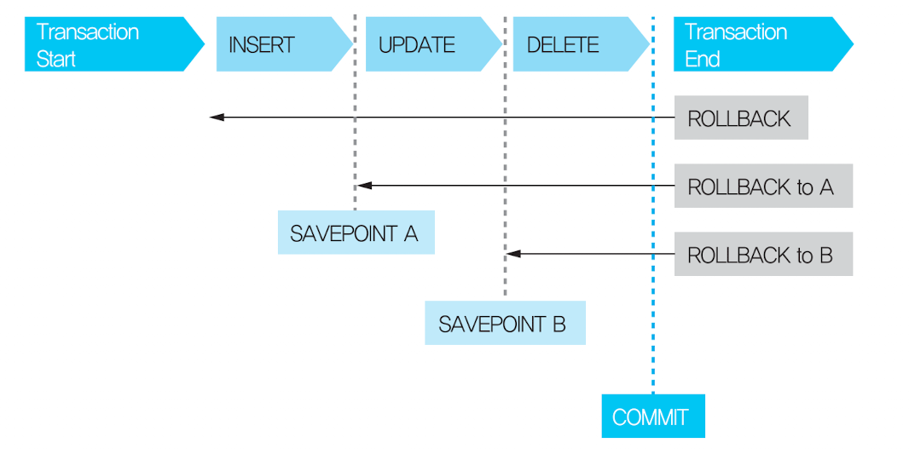

# Part 2) 관리구문

| 구문 종류 | 의미          | 주요 명령어                            | 설명                              |
| --------- | ------------- | -------------------------------------- | --------------------------------- |
| DML       | 데이터 조작   | INSERT, UPDATE, DELETE, MERGE          | 테이블 삽입, 수정, 삭제, 병합     |
| TCL       | 트랜잭션 제어 | COMMIT, ROLLBAK, SAVEPOINT             | 작업 완료, 취소, 중간 저장점 지정 |
| DDL       | 데이터 정의   | CREATE, ALTER, DROP, RENAME, TRUNCATE  | 테이블 구조 정의, 수정, 삭제      |
| DCL       | 권한 제어     | GRANT, REVOKE, CREATE, USER, DROP USER | 사용자 생성 및 권한 부여          |

## 1. DML

Data Manipulation Language 은 DDL에서 정의한 대로 데이터 **입력, 수정, 삭제, 조회**하는 명령어

**`INSERT, UPDATE, DELETE, MERGE`**

### 1) INSERT

```sql
INSERT INTO 테이블명 (컬럼명1, 컬럼명2 ...) VALUES (데이터1, 데이터2);
-- 또는
INSERT INTO 테이블명 VALUES (전체 컬럼에 대한 데이터);
```

명시하지 않은 컬럼은 **`NULL`**이 입력되며, **PK나 NOT NULL 컬럼이 누락되면 에러가 발생한다.**

### 2) UPDATE

```sql
UPDATE 테이블명 SET 컬럼명 = 새로운 데이터 (WHERE 수정할 데이터 조건);
```

### 3) DELETE

```sql
DELETE FROM 테이블명 (WHERE 삭제할 데이터에 대한 조건)
```

<aside>
⚠️

WHERE 없으면 전체 테이블 row가 삭제될 수 있음.

</aside>

전체 테이블을 삭제할때는 **`TRUNCATE`**를 쓰면 유리하다. 하지만 별도의 로그가 쌓이지 않아 **`ROLLBACK`**이 불가능하며, **DELETE는 COMMIT 전에 ROLLBACK이 가능하다.**

### 4) MERGE

테이블에 새로운 데이터를 입력하거나 이미 저장되어 있는 데이터에 대한 변경 작업을 한 번에 할 수 있도록 함.

```sql
MERGE
	INTO 타겟 테이블명
 USING 비교 테이블명
		ON 조건
WHEN MATCHED THEN
	  UPDATE
		  SET 컬럼명 = 새로운 데이터 [, 컬럼명 = 새로운 데이터 ...]
WHERE NOT MATCHED THEN
		INSERT [(컬럼명1, 컬럼명2 ...)]
		VALUES (데이터1, 데이터2, ...);

```

`p.349 문제) <주의> 순서대로 WHEN MATCHED THEN 구문이 동작후, WHERE NOT MATCHED THEN이 동작한다.`

## TCL

Transaction Control Language라는 의미로 트랜잭션을 제어하는 명령어이다.

**`COMMIT, ROLLBACK, SAVEPOINT`**

- **트랜잭션이란**? 쪼개질 수 없는 업무처리의 단위

### 1) 트랜잭션의 특징

| **특징**                 | **설명**                                                                                |
| ------------------------ | --------------------------------------------------------------------------------------- |
| **원자성 (Atomicity)**   | 트랜잭션은 모두 수행되거나, 전혀 수행되지 않아야 한다. 중간 실패 시 전체 작업이 취소됨. |
| **일관성 (Consistency)** | 트랜잭션 수행 전후의 데이터가 정해진 규칙(제약 조건 등)을 항상 만족해야 함.             |
| **고립성 (Isolation)**   | 여러 트랜잭션이 동시에 실행될 때 서로의 작업에 영향을 주지 않아야 함.                   |
| **지속성 (Durability)**  | 트랜잭션이 완료되면 그 결과는 영구적으로 저장되어 시스템이 장애가 나도 보존됨.          |

### 2) COMMIT

insert, delete, update 후 변경된 내용을 확정, 반영하는 명령어.

커밋을 하지 않으면 메모리까지만 반영된다. 메모리는 휘발성이기 때문에 언제든 사라질 수 있고 다른 사용자가 변경된 값을 조회할 수 없다. commit 을 실행해야 최종적으로 데이터 파일에 기록이 되고 트랜잭션이 완료된다.

### 3) ROLLBACK

변경된 내용을 취소하는 명령어.

<aside>
⚠️

update한 뒤 오랜 시간동안 commit 이나 rollback을 하지 않을 경우, lock이 걸려 다른 사용자가 변경할 수 없는 상황이 발생할 수 있으니 주의해야한다.

</aside>

### 4) SAVEPOINT

롤백을 수행할 때 전체 작업을 되돌리지 않고 일부만 되돌릴 수 있게 하는 기능을 가진 명령어.

롤백 뒤에 특정 SAVEPOINT를 지정해주면 그 지점까지만 데이터가 복구된다.



## 3. DDL: 데이터 정의어

Data Definition Language. 데이터 정의어, 즉 데이터를 정의하는 SQL이다.

**`CREATE, ALTER, DROP, RENAME, TRUNCATE`**

- CHAR: 고정 크기 → 스페이스를 문자로 안쳐서 `‘하이’ = ‘하이 ‘` 같다고 인정됨.
- VARCHAR: 가변 크기 → 스페이스 문자로 침

### 1) CREATE

테이블 생성

```sql
CREATE TABLE 테이블명 (
	컬럼명1   데이터 타입 (DEFAULT / NULL 여부),
	...
);
```

- NULL: 공백(’ ‘)과 다르며 존재하지 않는 값
- DEFAULT: 데이터의 기본값.

**규칙(에러 발생)**

- 테이블명은 고유해야 한다.
- 한 테이블 내에서 컬럼명은 고유해야 한다.
- 컬럼명 뒤에 데이터 유형과 데이터 크기가 명시되어야 한다.
- 컬럼에 대한 정의는 괄호() 안에 기술한다.
- 각 컬럼들은 , (콤마)로 구분된다.
- 테이블명과 컬럼명은 숫자로 시작될 수 없다.
- 마지막은 ; (세미콜론)으로 끝난다.

**에러를 발생하지는 않는 규칙**

- 테이블은 각각의 정체성을 나타내는 이름을 가져야 한다. 정체 모를 이름의 테이블을 만들지 말자.
- 컬럼명은 다른 테이블과 통일성이 있어야 한다. 같은 데이터를 저장하는 컬럼이 A테이블에서는 customer_id이고 B 테이블에선 member_id이면 …별로다.

**제약조건**

- **primary key(기본키)**: row의 고유값, PK로 지정된 컬럼은 null이 입력될 수 없고 자동으로 unique 인덱스로 생성됨
- **unique key(고유키)**: primary key와 유사하게 테이블에 저장된 각각의 row에 대한 고유성을 보장하지만 null이 허용됨
- **not null**: 해당 컬럼에는 null 불가능
- **check**: 컬럼에 저장될 수 있는 값의 범위를 제한
  - 예) `constraint chk_del_yn check(DEL_TN IN(’Y’, ‘N’))`
    : 삭제여부 컬럼에 y, n만 입력될 수 있도록 chk_del_yn이란 이름의 제약조건을 정의함.
- foreign key(외래키): 어떤 테이블의 컬럼이 **다른 테이블의 기본키(PK)**를 참조하는 키.

**참조 무결성 규정 관련 옵션**

| CASCADE     | parent 값 삭제 시 child 값 같이 삭제                                                 |
| ----------- | ------------------------------------------------------------------------------------ |
| SET NULL    | parent 값 삭제 시 child 의 해당 컬럼 NULL 처리                                       |
| SET DEFAULT | parent 값 삭제 시 child 의 해당 컬럼 DEFAULT 값으로 변경                             |
| RESTRICT    | child 테이블에 해당 데이터가 pk로 존재하지 않는 경우에만 Parent 값 삭제 및 수정 가능 |
| NO ACTION   | 참조 무결성 제약이 걸려있는 경우 삭제 및 수정 불가                                   |

**테이블 복사**

```sql
CREATE 테이블명 AS SELECT * FROM 복사할 테이블명;
```

### 2) ALTER

1.  **ADD COLUMN**
    새로운 컬럼을 추가할 때 쓰는 명령어이다. 추가된 컬럼의 위치는 늘 **`맨 끝`**!

        ```sql
        ALTER TABLE 테이블명 ADD 컬럼명 데이터 유형;
        -- 예시
        ALTER TABLE TEACHER ADD BIRTHDAY VARCHAR2(8)
        ```

        <aside>
        ⚠️

        Oracle에서는 **VARCHAR는 VARCHAR2의 동의어**로 처리되지만, **앞으로 표준 SQL에서 VARCHAR가 다르게 정의될 가능성**이 있기 때문에 Oracle에서는 VARCHAR 사용을 **비추천**

        </aside>

2.  **DROP COLUMN**
    컬럼 삭제. **`삭제한 컬럼은 복구할 수 없다.`**

        ```sql
        ALTER TABLE 테이블명 DROP COLUMN 컬럼명;
        -- 예시
        ALTER TABLE TEACHER DROP COLUMN ADDRESS;
        ```

3.  **MODIFY COLUMN**
    컬럼 변경. 데이터 유형, default 값, not null 제약조건에 대한 변경 가능. - 단, 데이터가 없는 경우에만 유형 변경 가능 - 단, 데이터 크기를 줄일 땐 데이터가 줄이는 크기보다 작아야 가능.

        ```sql
        ALTER TABLE 테이블명 MODIFY (컬럼명1 데이터 유형 [DEFAULT 값][NOT NULL], 컬럼명2 ...);
        -- 예시
        ALTER TABLE TEACHER MODIFY (BIRTHDAY VARCHAR2(8) DEFAULT '99999999' NOT NULL);
        ```

4.  **RENAME COLUMN**
    컬럼 이름 변경

        ```sql
        ALTER TABLE 테이블명 RENAME COLUMN MOBILE_NO TO HP_NO;
        -- 예시
        ALTER TABLE TEACHER RENAME COLUMN MOBILE_NO TO HP_NO;
        ```

5.  **ADD CONSTRAINT**
    제약조건을 추가하고 싶을 때 쓰는 명령어

        ```sql
        ALTER TABLE 테이블명 ADD CONSTRAINT 제약조건명 제약조건 (컬럼명);
        -- 예시
        ALTER TABLE TEACHER ADD CONSTRAINT TEACHER_FK FOREIGN KEY (SUBJECT_ID) REFERENCES SUBJECT(SUBJECT_ID);
        ```

        TEACHER 테이블의 SUBJECT_ID는 반드시 SUBJECT 테이블의 SUBJECT_ID에 존재하는 값만 들어올 수 있도록 제한합니다.(외래키 설정)  존재하지 않는 과목을 가르치는 교사는 등록할 수 없게 됩니다.

### 3) DROP TABLE

테이블 삭제.

- 참조하고 있는 다른 테이블이 존재하는 경우 CASCADE 옵션을 명시하지 않으면 삭제되지 않음.
- CASCADE CONSTRAINT는 제약조건도 함께 삭제한다는 의미

```sql
DROP TABLE 테이블명 [CASCADE CONSTRAINT];
```

### 4) RENAME TABLE

테이블명 변경

```sql
RENAME 기본 테이블명 TO 변경할 테이블명
```

### 5) TRUNCATE TABLE

테이블에 저장되어 있는 데이터 모두 삭제. 롤백에 불가능해 DDL로 분류됨.

```sql
TRUNCATE TABLE 테이블명;
```

## 4. DCL

Data Control Language. USER 생성, 권한 부여 및 회수

`CREATE USER, ALTER USER, DROP USER`

### 1) USER 관련 명령어

1.  CREATE USER
    사용자 생성. CREATE USER 권한이 있어야 가능.

        ```sql
        CREATE USER 사용자명 IDENTIFIED BY 패스워드;
        -- 예시
        CREATE USER INHO IDENTIFIED BY PW1234;
        ```

2.  ALTER USER
    사용자 변경

        ```sql
        ALTER USER 사용자명 IDENTIFIED BY 패스워드;
        -- 예시
        ALTER USER INHO IDENTIFIED BY PW5678;
        ```

3.  DROP USER
    사용자 삭제

        ```sql
        DROP USER 사용자명;
        -- 예시
        DROP USER INHO;
        ```

### 2) 권한 관련 명령어

1.  GRANT
    사용자 권한 부여

        ```sql
        GRANT 권한 TO 사용자명;
        -- 예시
        GRANT CREATE SESSION TO INHO;
        GRANT CREATE USER TO INHO;
        GRANT CREATE TABLE TO INHO;
        ```

2.  REVOKE
    사용자 권한 회수

        ```sql
        REVOKE 권한 TO 사용자명;
        -- 예시
        REVOKE CREATE TABLE TO INHO;
        ```

### 3) ROLE 관련 명령어

여러 권한들을 묶어서 하나의 이름으로 지정해줄 수 있다.

```sql
-- 롤 생성
CREATE ROLE 롤명;
-- 권한 부여
GRANT 권한 TO 롤명;
-- 롤 사용자에게 부여
GRANT 롤명 TO 사용자명;
```

예) `CREATE SESSION, CREATE USER, CREATE TABLE` 권한을 묶어 `CREATE_R`로 지정하기

```sql
-- 롤 생성
CREATE ROLE CREATE_R;
-- 권한 부여
GRANT CREATE SESSION, CREATE USER, CREATE TABLE TO CREATE_R;
-- 롤 사용자에게 부여
GRANT CREATE_R TO INHO;
```

## 문제 p.362

1. 3
2. 4
3. 3
4. 4 → 2번 truncate table 명령어는 table이 삭제되지는 않는다.
5. 1 → 2번 DDL(테이블 생성) 수행시 묵시적으로 COMMIT 수행되어서 1번 테이블은 롤백되지 않음.
6. 2 → 1번 insert문에서 컬럼명이 명시되지 않을 경우 전체 컬럼을 삽입해주어야 한다.
7. 2
8. 4
9. 3 → 1, 3 modify는 괄호() 로 묶는 줄 알았으나, 괄호가 없어도 가능함.
10. 2 → 3, 4 alter는 이미 컬럼에 관한 내용이라 column이 안붙는다.
11. 2
12. 2 → `SAVEPOINT TO sp1` 세이브포인트로 가는 명령어.
13. 1
14. 3
15. 4
16. 3
17. 3 → 1 조회 및 변경이라고 했으니 `GRANT SELECT, UPDATE ON a.table TO b;`
18. 4
19. 1
20. 3
